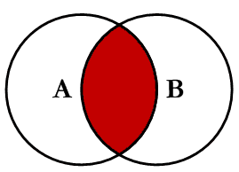
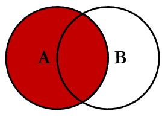
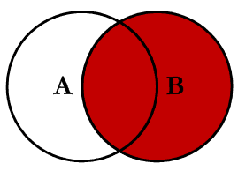
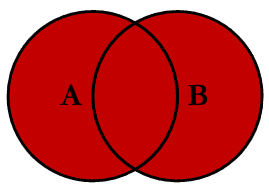
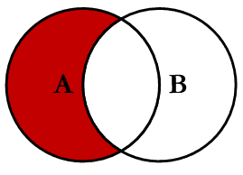
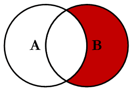
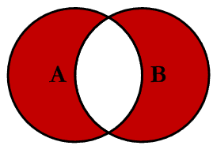

# SQL Reference

## Order of queries:

`SELECT` > `FROM` > `WHERE` > `GROUP BY` > `HAVING` > `ORDER BY` > `LIMIT`/`OFFEST`

## Table of Contents
- [1. SELECT](#1-select)
- [2. SELECT DISTINCT](#2-select-distinct)
- [3. WHERE](#3-where)
  - [3.1. Operators used with WHERE](#31-operators-used-with-where)
- [4. ORDER BY](#4-order-by)
  - [4.1. AND operator](#41-and-operator)
  - [4.2. OR operator](#42-or-operator)
  - [4.3. NOT operator](#43-not-operator)
- [5. INSERT INTO](#5-insert-into)
  - [5.1. Insert multiple rows](#51-insert-multiple-rows)
- [6. NULL values](#6-null-values)
  - [6.1. Test IS NULL](#61-test-is-null)
  - [6.2. Test IS NOT NULL](#62-test-is-not-null)
- [7. UPDATE](#7-update)
  - [7.1. UPDATE multiple records](#71-update-multiple-records)
- [8. DELETE](#8-delete)
  - [8.1. DELETE all rows](#81-delete-all-rows)
  - [8.2. DELETE the table](#82-delete-the-table)
- [9. SELECT TOP](#9-select-top)
  - [9.1. SELECT TOP with WHERE](#91-select-top-with-where)
  - [9.2. SELECT TOP with ORDER BY](#92-select-top-with-order-by)
- [10. MIN and MAX](#10-min-and-max)
- [11. COUNT](#11-count)
  - [11.1. Ignore Duplicates](#111-ignore-duplicates)
  - [11.2. Use an Alias](#112-use-an-alias)
- [12. SUM](#12-sum)
  - [12.1. WHERE and Alias](#121-where-and-alias)
  - [12.2. SUM with an Expression](#122-sum-with-an-expression)
- [13. AVG](#13-avg)
  - [13.1. WHERE and Alias](#131-where-and-alias)
  - [13.2. Higher Than Average](#132-higher-than-average)
- [14. LIKE](#14-like)
  - [14.1. Combine AND and OR](#141-combine-and-and-or)
- [15. Wildcard Characters](#15-wildcard-characters)
- [16. IN](#16-in)
  - [16.1. IN and NOT IN](#161-in-and-not-in)
  - [16.2. NOT IN](#162-not-in)
- [17. BETWEEN](#17-between)
  - [17.1. NOT BETWEEN](#171-not-between)
  - [17.2. BETWEEN with IN](#172-between-with-in)
  - [17.3. BETWEEN Text Values](#173-between-text-values)
  - [17.4. NOT BETWEEN Text Values](#174-not-between-text-values)
  - [17.5. BETWEEN Dates](#175-between-dates)
- [18. AS](#18-as)
  - [18.1. Aliases With a Space Character](#181-aliases-with-a-space-character)
  - [18.2. Concatenate Columns](#182-concatenate-columns)
  - [18.3. Virtual Columns](#183-virtual-columns)
  - [18.4. Alias for Tables](#184-alias-for-tables)
- [19. JOIN](#19-join)
  - [19.1. INNER JOIN](#191-inner-join)
  - [19.2. LEFT OUTER JOIN](#192-left-outer-join)
  - [19.3. RIGHT OUTER JOIN](#193-right-outer-join)
  - [19.4. FULL OUTER JOIN](#194-full-outer-join)
  - [19.5. LEFT excluding JOIN](#195-left-excluding-join)
  - [19.6. RIGHT excluding JOIN](#196-right-excluding-join)
  - [19.7. FULL OUTER excluding JOIN](#197-full-outer-excluding-join)
  - [19.8. Self JOIN](#198-self-join)
- [20. UNION](#20-union)
  - [20.1. UNION ALL](#201-union-all)
  - [20.2. UNION With WHERE](#202-union-with-where)
  - [20.3. UNION ALL With WHERE](#203-union-all-with-where)
- [21. GROUP BY](#21-group-by)
  - [21.1. GROUP BY With JOIN](#211-group-by-with-join)
- [22. HAVING](#22-having)
- [23. EXISTS](#23-exists)
- [24. ANY and ALL](#24-any-and-all)
  - [24.1. ANY](#241-any)
  - [24.2. ALL](#242-all)
- [25. SELECT INTO](#25-select-into)
- [26. INSERT INTO SELECT](#26-insert-into-select)
- [27. CASE](#27-case)
- [28. Stored Procedures](#28-stored-procedures)
- [29. Comments](#29-comments)
  - [29.1. Single Line Comments](#291-single-line-comments)
  - [29.2. Multi-line Comments](#292-multi-line-comments)
- [30. Operators](#30-operators)


## 1. SELECT 
[Back to Table of Contents](#table-of-contents)

```sql
-- Select all columns
SELECT * FROM tableName;
SELECT colum1,colum2 FROM tableName;
```


## 2. SELECT DISTINCT
[Back to Table of Contents](#table-of-contents)

```sql
-- Removes duplicates
SELECT DISTINCT colum1,colum2 FROM tableName;

-- Count distinct values
SELECT COUNT(DISTINCT col1,...) FROM tableName; -- not supported in MS Server
SELECT Count(*) AS DistinctCountries FROM (SELECT DISTINCT colum1,.. FROM tableName); -- supported in MS server
SELECT colum1 AS newName1, colum2 AS newName2 FROM tableName;`
```

## 3. WHERE
[Back to Table of Contents](#table-of-contents)

```sql
-- filter records/rows
SELECT colum1,.. FROM tableName WHERE condition1;
SELECT colum1,.. FROM tableName WHERE colum1='dataToCompare';
SELECT colum1,.. FROM tableName WHERE colum1=1;  
```

#### 3.1. operators used with WHERE

`<, >, >=, <=, BETWEEN, LIKE, IN`

```sql
-- BETWEEN, LIKE, IN
SELECT colum1,.. FROM tableName WHERE colum1 BETWEEN 2 AND 4;
SELECT colum1,.. FROM tableName WHERE colum1 > 5;
SELECT colum1,.. FROM tableName WHERE colum1 LIKE '%c%';
SELECT * FROM tableName WHERE column1 IN ('dataName');
```

## 4. ORDER BY 
[Back to Table of Contents](#table-of-contents)

```sql
-- Ascending order by default
SELECT * FROM tableName ORDER BY column; -- for string values will order in asc order

-- Order by multiple columns
SELECT * FROM tableName ORDER BY column1 ASC, column2 DESC;
SELECT * FROM tableName ORDER BY column1, column2; -- will order by col1 but if col1 has the same values then col2 will be triggered
SELECT * FROM TableName ORDER BY 1; -- 1 is the column number
```

#### 4.1. AND operator

```sql
-- flitering more than one condition. Both opernads need to be true
SELECT * FROM tableName WHERE column1='data' AND (column1 LIKE '%c%' OR column2 BETWEEN 2 AND 5); -- without () the filtering the sec argument OR will not take into account column1
SELECT * FROM tableName WHERE column1='data' AND column > number;
```

#### 4.2. OR operator

```sql
-- If any condition is true
SELECT * FROM tableName WHERE column1 = 'data' OR column1 = 'data';
SELECT * FROM tableName WHERE column1 = 'data' OR column2 LIKE 'G%' OR column3 = 'data'; -- at least one condition must be true
```

#### 4.3. NOT operator 

```sql
-- Combine with other operators like `AND`, `OR` , `=`, `LIKE` etc. and gives oposite result
SELECT * FROM tableName NOT column1='data';
SELECT * FROM tableName column1='data' AND NOT column2='data';
SELECT * FROM tableName WHERE column NOT LIKE 'A%';
SELECT * FROM tableName WHERE column NOT BETWEEN 10 AND 60;
SELECT * FROM tableName WHERE column NOT IN ('Paris', 'London');
SELECT * FROM tableName WHERE NOT column > 50;` same as -> `SELECT * FROM tableName WHERE column !> 50;
SELECT * FROM tableName WHERE NOT column < 50;` same as -> `SELECT * FROM tableName WHERE column !< 50;
```

## 5. INSERT INTO
[Back to Table of Contents](#table-of-contents)

```sql
-- Insert new  record/row into table
INSERT INTO table_name (column1, column2, column3, ...)
VALUES (value1, value2, value3, ...);
```

#### 5.1. Insert multiple rows 

```sql
ISERT INTO tableName (column1, column2, column3)
VALUES 
('val1', 'val2', 'val3'),
('val4', 'val5', 'val6'),
('val7', 'val8', 'val9');
```

## 6. NULL values
[Back to Table of Contents](#table-of-contents)

`NULL` is a field with no value. If a field in a table is optional, it is possible to insert a new record or update a record without adding a value to this field. Then, the field will be saved with a `NULL` value. A field with a `NULL` value is one that has been left blank during record creation.

#### 6.1. Test IS NULL
  
```sql  
SELECT column
FROM tableName
WHERE column IS NULL;
```

#### 6.2. Test IS NOT NULL

```sql
SELECT column
FROM tableName
WHERE column IS NOT NULL;
```

## 7. UPDATE 
[Back to Table of Contents](#table-of-contents)

```sql
-- Modify the existing records in a table
UPDATE table_name
SET column1 = value1, column2 = value2, ...
WHERE condition;
```

**Note:**
*Be careful when updating records in a table! The `WHERE` clause in the UPDATE statement. The `WHERE` clause specifies which record(s) that should be updated. If you omit the `WHERE` clause, all records in the table will be updated.*

```sql
UPDATE tableName
SET column = 'Marcin Tatarski', City= 'London'
WHERE userID = 1;
```

#### 7.1 UPDATE multiple records

```sql
-- Without WHERE clause that determines how many records will be updated
UPDATE tableName SET name = 'Marcin Tatarski';
```

## 8. DELETE 
[Back to Table of Contents](#table-of-contents)

```sql
-- Delete existing records in a table
DELETE FROM tableName WHERE condition;
```

**Note:**
*Be careful when deleting records in a table! The `WHERE` clause in the `DELETE` statement. 
The `WHERE` clause specifies which record(s) should be deleted. If you omit the `WHERE` clause, 
all records in the table will be deleted.*

#### 8.1. DELETE all rows

```sql
-- Delete all rows in a table without deleting the table
DELETE FROM tableName;
```

#### 8.2. DELETE the table

```sql
DROP TABLE tableName;
```

## 9. SELECT TOP 
[Back to Table of Contents](#table-of-contents)

`SELECT TOP` used to specify the number of records to return. The `SELECT TOP` clause is useful on large tables with thousands of records. Returning a large number of records can impact performance.

- SQL Server / MS Access Syntax

```sql
SELECT TOP number|percent column(s)
FROM tableName
WHERE condition;
```
  
```sql
SELECT TOP number * FROM tableName;
SELECT TOP 50 PERCENT * FROM tableName;
```

- MySQL Syntax

```sql
SELECT column(s)
FROM tableName
WHERE condition
LIMIT number;
```
  
```sql
SELECT * FROM tableName LIMIT number;
```

#### 9.1. SELECT TOP with WHERE

- SQL Server/MS Access

```sql
SELECT TOP 3 * FROM tableName WHERE column='text';
```

- MySQL

```sql
SELECT * FROM tableName WHERE column='text' LIMIT 3;
```

#### 9.2. SELECT TOP with ORDER BY

- SQL Server/MS Access

```sql
SELECT TOP * 3 FROM tableName ORDER BY column DESC;
```

- MySQL

```sql
SELECT * FROM tableName ORDER BY column DESC LIMIT 3;
```

## 10. MIN and MAX
[Back to Table of Contents](#table-of-contents)

- The MIN() function returns the smallest value of the selected column.
  
```sql
SELECT MIN(column)
FROM tableName
WHERE condition;
```

- The MAX() function returns the largest value of the selected column.
  
```sql
SELECT MAX(column)
FROM tableName
WHERE condition;
```

## 11. COUNT
[Back to Table of Contents](#table-of-contents)

```sql
--  COUNT() Function, number of rows that matches a specified criterion
SELECT COUNT(column)
FROM tableName
WHERE condition;
```
  
#### 11.1. Ignore Duplicates
  
```sql
SELECT COUNT(DISTINCT column) FROM tableName;
```

#### 11.2. Use an Alias

```sql
SELECT COUNT(*) AS [long text] FROM tableName;
```

## 12. SUM
[Back to Table of Contents](#table-of-contents)

```sql
-- SUM() Function, total sum of a numeric column
SELECT SUM(column)
FROM tableName
WHERE condition;
``` 

#### 12.1. WHERE and Alias

```sql
SELECT SUM(column) AS text FROM tableName WHERE column = condition;
```

#### 12.2. SUM with an Expression

```sql
SELECT SUM(Quantity * 10) FROM tableName;
```

## 13. AVG()
[Back to Table of Contents](#table-of-contents)

```sql
-- AVG() Function, average value of a numeric column
SELECT AVG(column)
FROM tableName
WHERE condition;
```

**Note:**
*`NULL` values are ignored*

#### 13.1. WHERE and Alias

```sql
SELECT AVG(column) AS text FROM tableName WHERE column = condition;
```

#### 13.2. Higher Than Average

```sql
-- We can use the `AVG()` function in a subquery
SELECT * FROM tableName WHERE column > (SELECT AVG(column) FROM tableName);
```

## 14. LIKE()
[Back to Table of Contents](#table-of-contents)

```sql
-- LLIKE() operator, is used in a WHERE clause to search for a specified pattern in a column
SELECT column1, column2, ...
FROM tableName
WHERE column1 LIKE pattern;
```

**Note:**
*There are two wildcards often used in conjunction with the LIKE operator:*
- *The percent sign % represents zero, one, or multiple characters*
- *The underscore sign _ represents one, single character*

#### 14.1. Combine AND and OR

```sql
SELECT * FROM tableName WHERE colName1 LIKE 'a%' OR colName2 LIKE 'b%';
```

## 15. Wildcard Characters
[Back to Table of Contents](#table-of-contents)

```sql
-- Wildcard char used to substitute one or more characters in a string
SELECT * FROM tableName WHERE colName LIKE '[aer]%';
SELECT * FROM tableName WHERE colName LIKE '[a-f]%';
```

- `%`  Represents zero or more characters						 	
- `_`  Represents a single character
- `[]` Represents any single character within the brackets *				
- `^`  Represents any character not in the brackets *
- `-`  Represents any single character within the specified range *
- `{}` Represents any escaped character **

`*` Not supported in PostgreSQL and MySQL databases.
`**` Supported only in Oracle databases.

**Note:**
*Wildcard characters are used with the LIKE operator. 
The LIKE operator is used in a WHERE clause to search for a specified pattern in a column.*

## 16. IN 
[Back to Table of Contents](#table-of-contents)

```sql
-- IN operator. Allows you to specify multiple values in a WHERE clause
SELECT column(s)
FROM tableName
WHERE column IN (value1, value2, ...);
```

**Note:**
*The `IN` operator is a shorthand for multiple OR conditions.*

#### 16.1 IN and NOT IN


```sql
-- IN (SELECT) & `NOT IN` (SELECT), you can also use IN with a subquery in the WHERE 
SELECT * FROM tableName WHERE column IN (SELECT column FROM tableName);
```

#### 16.2. NOT IN 

```sql
-- NOT IN return all records that are NOT any of the values in the list
SELECT * FROM tableName WHERE column NOT IN (conditions, ...);
```

## 17. BETWEEN
[Back to Table of Contents](#table-of-contents)

The `BETWEEN` operator selects values within a given range. The values can be numbers, text, or dates.
The `BETWEEN` operator is inclusive: begin and end values are included. 

```sql
SELECT * FROM tableName
WHERE column BETWEEN value1 AND value2;
```

#### 17.1. NOT BETWEEN

```sql
-- To display the column outside the range 
SELECT * FROM tableName
WHERE column BETWEEN value1 AND value2;
```

#### 17.2. BETWEEN with IN

```sql
-- IN is the shortcut for OR operator
SELECT * FROM tableName
WHERE column1 BETWEEN numericValue1 AND numericValue2
AND column2 IN (numericValue1, numericValue2, numericValue3);
```

#### 17.3. BETWEEN Text Values

```sql
SELECT * FROM tableName
WHERE column1 BETWEEN textValue1 AND textValue1
ORDER BY column;
```

#### 17.4. NOT BETWEEN Text Values

```sql
SELECT * FROM tableName
WHERE column1 NOT BETWEEN textValue1 AND textValue1
ORDER BY column;
```

#### 17.5. BETWEEN Dates

```sql
SELECT * FROM tableName;
WHERE column BETWEEN #day/month/year# AND #day/month/year#;
```

## 18. AS
[Back to Table of Contents](#table-of-contents)

SQL aliases `AS` are used to give a table, or a column in a table, a temporary name. An alias only exists for the duration of that query.

```sql
SELECT column1 AS newName
FROM tableName; 
```

#### 18.1. Aliases With a Space Character

- using [square brackets] 
```sql
SELECT tableName AS [some text with spaces]
FROM Products;
```

- using "double quotes"
```sql
SELECT tableName AS "some text with spaces"
FROM Products;
```

#### 18.2. Concatenate Columns

```sql
SELECT column1, column2 + ', ' + column3 + ' ' + column5 + ', ' + column4 AS newName
FROM tableName; 
```

- MySQL
```sql
SELECT column1, CONCAT(column2, ', ',column3,' ',column5,', ',column4) AS newName
FROM tableName; 
```

#### 18.3. Virtual Columns

When you use a literal value or expression in a `SELECT` statement, you are essentially creating a virtual or temporary column in the result set. This column is not part of the original table but is generated on the fly during the query execution.

```sql
SELECT 'Hello' AS Greeting, Name
FROM Users;
```

#### 18.4. Alias for Tables

- Using more than one table in your queries, it can make the SQL statements shorter.

```sql
SELECT t1.column1, t1.column2, t2.colum1
FROM tableName1 AS t1, tableName2 AS t2
WHERE t2.column1='some txt' AND t2.ID = t1.ID;
```

- without aliases
```sql
SELECT tableName1.column1, tableName1.column2, tableName2.colum1
FROM tableName1, tableName2
WHERE tableName2.column1='some txt' AND tableName2.ID = tableName1.ID;
```

## 19. JOIN
[Back to Table of Contents](#table-of-contents)

A `JOIN` clause is used to combine rows from two or more tables, based on a related column between them.

#### 19.1. INNER JOIN
Returns records that have matching values in both tables.

**Note:**
*The `INNER JOIN` keyword returns only rows with a match in both tables. Which means that if you have a product with no column1, or with a column1 that is not present in the tableName1 table, that record would not be returned in the result.*

<div style="display: flex; height: 200px; margin-bottom: 35px">
  

  <div style="flex-grow: 1; overflow: hidden;">
    <pre style="margin: 0; height: 200px; color: white">      
        <span style="color:#bf7ccc">SELECT</span> column 
        <span style="color:#bf7ccc">FROM</span> tableName1 
        <span style="color:#bf7ccc">INNER JOIN</span> tableName2 
        <span style="color:#bf7ccc">ON</span> tableName1.ID = tableName2.ID      
    </pre>
  </div>
</div>

- Naming the Columns
It is a good practice to include the table name when specifying columns in the SQL statement.

```sql
  SELECT tab1.ProductID, tab1.ProductName, tab2.CategoryName
  FROM tableName1
  INNER JOIN tableName2 ON tab1.CategoryID = tab2.CategoryID;
```

- `JOIN` and `INNER JOIN` will return the same result. `INNER` is the default join type for `JOIN`, so when you write `JOIN` the parser actually writes `INNER JOIN`.

- `JOIN` Three Tables

```sql
  SELECT tab1.column1, tab2.column1, tab3.column1
  FROM ((tableName1
  INNER JOIN tableName2 ON tab1.ID = tab2.ID)
  INNER JOIN tableName3 ON tab1.ID = tab3.ID); 
```

#### 19.2. LEFT OUTER JOIN
Returns all records from the left table, and the matched records from the right table. The result is 0 records from the right side, if there is no match.

**Note:**
**In some databases `LEFT JOIN` is called `LEFT OUTER JOIN`.*
***The `LEFT JOIN` keyword returns all records from the left table, even if there are no matches in the right table*

<div style="display: flex; height: 200px; margin-bottom: 35px">
  

  <div style="flex-grow: 1; overflow: hidden;">
    <pre style="margin: 0; height: 200px; color: white">      
        <span style="color:#bf7ccc">SELECT</span> column 
        <span style="color:#bf7ccc">FROM</span> tableName1 
        <span style="color:#bf7ccc">LEFT JOIN</span> tableName2 
        <span style="color:#bf7ccc">ON</span> tableName1.ID = tableName2.ID      
    </pre>
  </div>
</div>

#### 19.3. RIGHT OUTER JOIN
Returns all records from the right table, and the matched records from the left table. The result is 0 records from the left side, if there is no match.

**Note:**
**In some databases `RIGHT JOIN` is called `RIGHT OUTER JOIN`.*
***The `RIGHT JOIN` keyword returns all records from the right table, even if there are no matches in the left table.*

<div style="display: flex; height: 200px; margin-bottom: 35px">
  

  <div style="flex-grow: 1; overflow: hidden;">
    <pre style="margin: 0; height: 200px; color: white">      
        <span style="color:#bf7ccc">SELECT</span> column 
        <span style="color:#bf7ccc">FROM</span> tableName1 
        <span style="color:#bf7ccc">RIGHT JOIN</span> tableName2 
        <span style="color:#bf7ccc">ON</span> tableName1.ID = tableName2.ID      
    </pre>
  </div>
</div>

#### 19.4. FULL OUTER JOIN
Returns all records when there is a match in either left or right table.

**Note:**
**`FULL OUTER JOIN` and `FULL JOIN` are the same.*
***`FULL OUTER JOIN` can potentially return very large result-sets*
****The `FULL OUTER JOIN` keyword returns all matching records from both tables whether the other table matches or not. So, if there are rows in "tableName1" that do not have matches in "tableName2", or if there are rows in "tableName2" that do not have matches in "tableName1", those rows will be listed as well.*

<div style="display: flex; height: 200px; margin-bottom: 35px">
  

  <div style="flex-grow: 1; overflow: hidden;">
    <pre style="margin: 0; height: 200px; color: white">      
        <span style="color:#bf7ccc">SELECT</span> column 
        <span style="color:#bf7ccc">FROM</span> tableName1 
        <span style="color:#bf7ccc">FULL OUTER JOIN</span> tableName2 
        <span style="color:#bf7ccc">ON</span> tableName1.ID = tableName2.ID      
    </pre>
  </div>
</div>

#### 19.5. LEFT excluding JOIN
Return all of the records in the left table (t1) that do not match any records in the right table (t2)

<div style="display: flex; height: 200px; margin-bottom: 35px">
  

  <div style="flex-grow: 1; overflow: hidden;">
    <pre style="margin: 0; height: 200px; color: white">      
        <span style="color:#bf7ccc">SELECT</span> column 
        <span style="color:#bf7ccc">FROM</span> tableName1 <span style="color:#bf7ccc">AS</span> t1
        <span style="color:#bf7ccc">LEFT JOIN</span> tableName2 <span style="color:#bf7ccc">AS</span> t2
        <span style="color:#bf7ccc">ON</span> t1.ID = t2.ID 
        <span style="color:#bf7ccc">WHERE</span> t2.ID <span style="color:#bf7ccc">IS NULL</span>     
    </pre>
  </div>
</div>

#### 19.6. RIGHT excluding JOIN
Return all of the records in the right table (t2) that do not match any records in the left table (t1)

<div style="display: flex; height: 200px; margin-bottom: 35px">
  

  <div style="flex-grow: 1; overflow: hidden;">
    <pre style="margin: 0; height: 200px; color: white">      
        <span style="color:#bf7ccc">SELECT</span> column 
        <span style="color:#bf7ccc">FROM</span> tableName1 <span style="color:#bf7ccc">AS</span> t1
        <span style="color:#bf7ccc">RIGHT JOIN</span> tableName2 <span style="color:#bf7ccc">AS</span> t2
        <span style="color:#bf7ccc">ON</span> t1.ID = t2.ID 
        <span style="color:#bf7ccc">WHERE</span> t1.ID <span style="color:#bf7ccc">IS NULL</span>     
    </pre>
  </div>
</div>

#### 19.7. FULL OUTER excluding JOIN
Return all of the records in the left table (t1) and all of the records in the right table (t2) that do not match

<div style="display: flex; height: 200px; margin-bottom: 35px">
  

  <div style="flex-grow: 1; overflow: hidden;">
    <pre style="margin: 0; height: 200px; color: white">      
        <span style="color:#bf7ccc">SELECT</span> column 
        <span style="color:#bf7ccc">FROM</span> tableName1 <span style="color:#bf7ccc">AS</span> t1
        <span style="color:#bf7ccc">FULL OUTER JOIN</span> tableName2 <span style="color:#bf7ccc">AS</span> t2
        <span style="color:#bf7ccc">ON</span> t1.ID = t2.ID 
        <span style="color:#bf7ccc">WHERE</span> t1.ID <span style="color:#bf7ccc">IS NULL OR</span> t2.ID <span style="color:#bf7ccc">IS NULL</span>     
    </pre>
  </div>
</div>

#### 19.8. Self JOIN

A self join is a regular join, but the table is joined with itself.

```sql
SELECT column
FROM tableName T1, tableName T2
WHERE condition;
```

**Note:**
*`T1` and `T2` are different table aliases for the same table.*

```sql
SELECT a.column1, b.column1, a.column2
FROM tableName a, tableName b
WHERE a.ID <> b.ID
AND a.column2 = b.column2
ORDER BY a.column2;
```

**Note:**
*`<>` means `NOT EQUAL`*

## 20. UNION
[Back to Table of Contents](#table-of-contents)

The `UNION` operator is used to combine the result-set of two or more `SELECT` statements.

- Every `SELECT` statement within `UNION` must have the same number of columns
- The columns must also have similar data types
- The columns in every `SELECT` statement must also be in the same order

```sql
SELECT column FROM tableName1
UNION
SELECT column FROM tableName2;
```

#### 20.1. UNION ALL

The `UNION` operator selects only distinct values by default. To allow duplicate values, use `UNION ALL`

```sql
SELECT column FROM tableName1
UNION ALL
SELECT column FROM tableName2;
```

**Note:**
*The column names in the result-set are usually equal to the column names in the first `SELECT` statement.*

#### 20.2. UNION With WHERE

```sql
SELECT column1, column2 FROM tableName1
WHERE column2 = 'text'
UNION
SELECT column2, column3 FROM tableName2
WHERE column3 = 'text'
ORDER BY column1;
```

#### 20.3. UNION ALL With WHERE

```sql
SELECT column1, column2 FROM tableName1
WHERE column2 = 'text'
UNION ALL
SELECT column2, column3 FROM tableName2
WHERE column3 = 'text'
ORDER BY column1;
```

## 21. GROUP BY
[Back to Table of Contents](#table-of-contents)

The `GROUP BY` statement groups rows that have the same values into summary rows, like "find the number of customers in each country".

The `GROUP BY` statement is often used with aggregate functions `COUNT()`, `MAX()`, `MIN()`, `SUM()`, `AVG()` to group the result-set by one or more columns.

```sql
SELECT COUNT(column1) AS [Count], column2
FROM tableName
GROUP BY column2;
```

#### 21.1. GROUP BY With JOIN

```sql
SELECT tab1.column1, COUNT(tab2.column2) AS customColumnName FROM tableName2 AS tab2
LEFT JOIN tableName1 AS tab1 ON tab2.ID = tab1.ID
GROUP BY column1;
```

## 22. HAVING
[Back to Table of Contents](#table-of-contents)

The `HAVING` clause was added to SQL because the `WHERE` keyword cannot be used with aggregate functions.

```sql
SELECT COUNT(id), column
FROM tableName
GROUP BY column
HAVING COUNT(id) > 5;
```

## 23. EXISTS
[Back to Table of Contents](#table-of-contents)

The `EXISTS` operator is used to test for the existence of any record in a subquery.
The `EXISTS` operator returns `TRUE` if the subquery returns one or more records.

```sql
SELECT column1
FROM tableName1
WHERE EXISTS (
  SELECT column2 FROM tableName1 WHERE tableName1.ID = tableName1.ID AND column3 < 20
);
```

## 24. ANY and ALL
[Back to Table of Contents](#table-of-contents)

The `ANY` and `ALL` operators allow you to perform a comparison between a single column value and a range of other values.

#### 24.1. ANY

The `ANY` operator:
- returns a boolean value as a result
- returns `TRUE` if ANY of the subquery values meet the condition

`ANY` means that the condition will be true if the operation is true for any of the values in the range.

```sql
SELECT column
FROM tableName
WHERE column operator ANY
  (SELECT column
  FROM tableName
  WHERE condition); 
```

**Note:**
*The operator must be a standard comparison operator (=, <>, !=, >, >=, <, or <=).*

#### 24.2. ALL

The `ALL` operator:
- returns a boolean value as a result
- returns `TRUE` if `ALL` of the subquery values meet the condition
- is used with `SELECT`, `WHERE` and `HAVING` statements

```sql
SELECT ALL column
FROM tableName
WHERE condition;
```

`ALL` means that the condition will be true only if the operation is true for all values in the range. 

## 25. SELECT INTO
[Back to Table of Contents](#table-of-contents)

The `SELECT INTO` statement copies data from one table into a new table.

```sql
-- Copy all columns into a new table in another database
SELECT *
INTO newTable IN 'backup.db'
FROM oldTable
WHERE condition;
```

```sql
-- Copy only some columns into a new table
SELECT column1, column2, column3, ...
INTO newTable IN 'backup.db'
FROM oldTable
WHERE condition;
```

```sql
-- Copies data from more than one table into a new table
SELECT tableName1.column1, tableName2.column2
INTO backup2023
FROM tableName1
LEFT JOIN tableName2 ON tableName1.ID = tableName2.ID;
```

## 26. INSERT INTO SELECT
[Back to Table of Contents](#table-of-contents)

The `INSERT INTO SELECT` statement copies data from one table and inserts it into another table.
The `INSERT INTO SELECT` statement requires that the data types in source and target tables match.

**Note:** 
*The existing records in the target table are unaffected.*

```sql
-- Copy all columns from one table to another table
INSERT INTO tableName2
SELECT * FROM tableName1
WHERE condition;
```

```sql
-- Copy only some columns from one table into another table
INSERT INTO tableName2 (column1, column2, column3, ...)
SELECT column1, column2, column3, ...
FROM tableName1
WHERE condition;
```

## 27. CASE
[Back to Table of Contents](#table-of-contents)

The `CASE` expression goes through conditions and returns a value when the first condition is met (like an if-then-else statement). So, once a condition is true, it will stop reading and return the result. If no conditions are true, it returns the value in the ELSE clause.

If there is no ELSE part and no conditions are true, it returns NULL.

```sql
SELECT column1, column2,
CASE 
  WHEN column2 > 30 THEN 'Is more than 30'
  WHEN column2 = 30 THEN 'Is 30'
ELSE 'Is under 30'
END AS customColumnText
FROM tableName;
```

```sql
SELECT column1, column2, column3 FROM tableName
ORDER BY (
CASE
	WHEN column2 IS NULL THEN column3
ELSE column2
END);
```

## 28. Stored Procedures
[Back to Table of Contents](#table-of-contents)

A stored procedure is a prepared SQL code that you can save, so the code can be reused over and over again.

So if you have an SQL query that you write over and over again, save it as a stored procedure, and then just call it to execute it.

You can also pass parameters to a stored procedure, so that the stored procedure can act based on the parameter value(s) that is passed.

## 29. Comments
[Back to Table of Contents](#table-of-contents)

#### 29.1. Single Line Comments

```sql
-- Select all:
SELECT * FROM tableName;
```

```sql
SELECT * FROM tableName -- WHERE City='Berlin';
```

#### 29.2. Multi-line Comments

```sql
/* some text
 between */
SELECT * FROM tableName;
```

```sql
SELECT column1, /*column2,*/ column3 FROM tableName;
```

## 30. Operators
[Back to Table of Contents](#table-of-contents)

#### 30.1. Arithmetic Operators

| Operator | Description | Example |
| ----------- | ----------- | ----------- |
| + | Add | SELECT 1 + 2; |
| - | Subtract | SELECT 2 - 1; |
| * | Multiply | SELECT 2 * 2; |
| / | Divide | SELECT 10 / 2; |
| % | Modulo | SELECT 10 % 2; |

#### 30.2. Comparison Operators

| Operator | Description | Example |
| ----------- | ----------- | ----------- |
| = | Equal to | SELECT * FROM tableName WHERE column = 1; |
| > | Greater than | SELECT * FROM tableName WHERE column > 1; |
| < | Less than | SELECT * FROM tableName WHERE column < 1; |
| >= | Greater than or equal to | SELECT * FROM tableName WHERE column >= 1; |
| <= | Less than or equal to | SELECT * FROM tableName WHERE column <= 1; |
| <> | Not equal to | SELECT * FROM tableName WHERE column <> 1; |

#### 30.3. Compound Operators

| Operator | Description | 
| ----------- | ----------- |
| += | Add equals | 
| -= | Subtract equals | 
| *= | Multiply equals | 
| /= | Divide equals | 
| %= | Modulo equals | 
| &= | Bitwise AND equals |
| ^-= | Bitwise exclusive equals | 
| \|*= | Bitwise OR equals | 

#### 30.4. Logical Operators

| Operator | Description | 
| ----------- | ----------- |
| ALL | TRUE if all of the subquery values meet the condition | 
| AND | TRUE if all the conditions separated by AND is TRUE | 
| ANY | TRUE if any of the subquery values meet the condition | 
| BETWEEN | TRUE if the operand is within the range of comparisons | 
| EXISTS | TRUE if the subquery returns one or more records | 
| IN | TRUE if the operand is equal to one of a list of expressions |
| LIKE | TRUE if the operand matches a pattern | 
| NOT | Displays a record if the condition(s) is NOT TRUE | 
| OR | TRUE if any of the conditions separated by OR is TRUE | 
| SOME | TRUE if any of the subquery values meet the condition | 